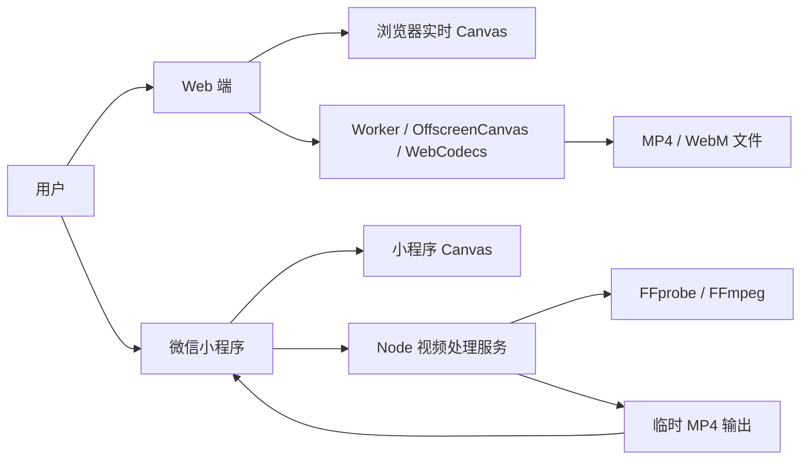
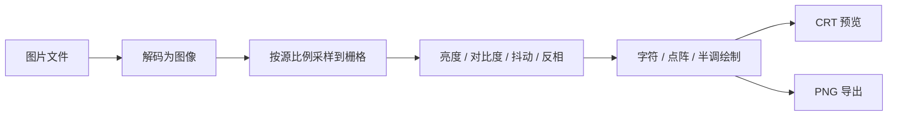
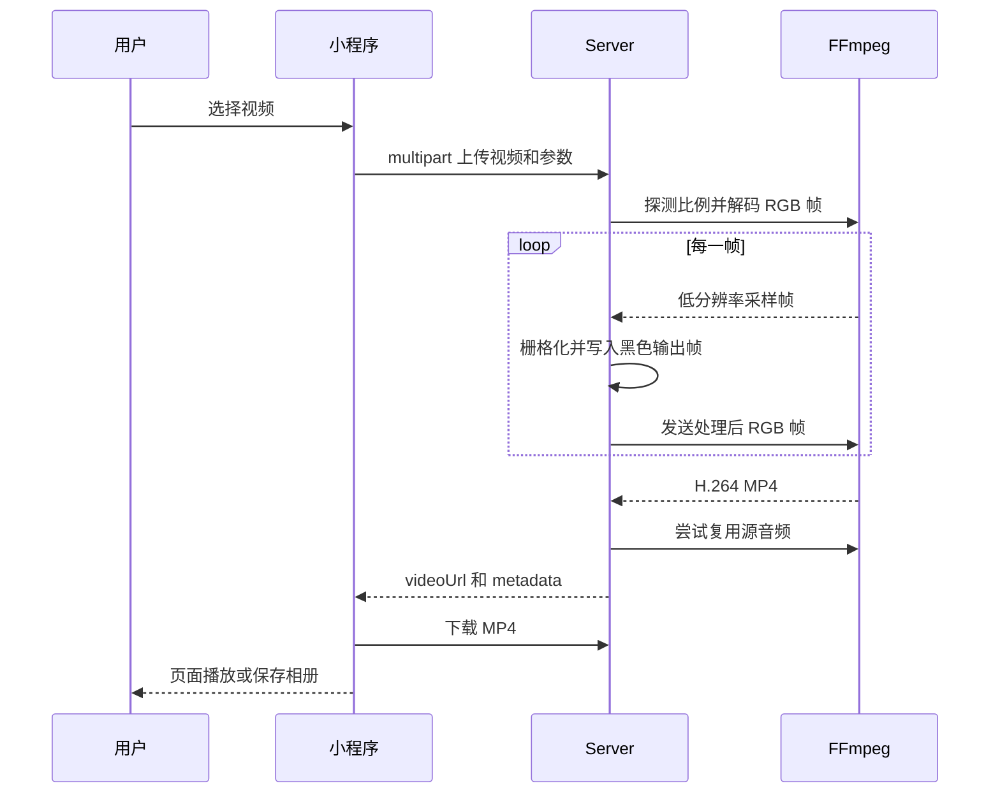

# 系统架构

## 架构目标

系统要在浏览器和微信小程序中提供一致的栅格化产品体验，同时接受各运行环境的能力差异：浏览器可以直接读取视频帧，小程序不能可靠逐帧读取本地视频，因此将视频处理交给 FFmpeg 服务。

## 系统上下文

## 运行单元

### Web

路径：`Web`

- `index.html` 定义控制台结构和输入控件。
- `styles.css` 实现拟物外壳、CRT、按键和响应式布局。
- `script.js` 管理页面状态、实时预览、导出面板和浏览器下载。
- 独立导出模块与 Worker 管理媒体解封装、逐帧高清渲染、WebCodecs 编码、音频和取消。
- Vite 提供本地安全上下文、ES 模块构建和 Worker/媒体库打包。

Web 图片完全在浏览器本地处理。Web 视频预览继续读取隐藏 `video` 元素；主要保存路径不读取页面播放时钟，而是在 Worker 中使用媒体库和 WebCodecs 离线处理。MediaRecorder 仅作为不支持 WebCodecs 时的兼容降级。

### MiniProgram

路径：`MiniProgram`

- `pages/index/index.wxml` 定义纵向电视控制台、Canvas 和处理后视频组件。
- `pages/index/index.wxss` 定义小程序专用布局和拟物视觉。
- `pages/index/index.js` 管理交互、图片 Canvas 渲染、视频上传/下载、播放和相册保存。

图片和开屏演示在本地 Canvas 处理。视频选择后只使用缩略图表示处理状态，完整视频发送给 Server；处理结果下载到小程序临时文件后播放。

### Server

路径：`Server`

- `server.js` 是无第三方 Node 依赖的 HTTP 服务和像素渲染器。
- `smoke-test.js` 启动服务并以 multipart 请求处理测试视频。
- FFprobe 读取视频尺寸和 sample aspect ratio。
- FFmpeg 解码 RGB 帧、编码 H.264 MP4，并尽可能把源音频编码为 AAC 后复用。
- 上传、静默视频、最终输出分别写入 `storage/uploads`、`storage/temp`、`storage/outputs`。

## 主要数据流

### 图片

### 小程序视频

## 模块所有权

- 产品参数名称由 `docs/contracts/rendering-parameters.md` 所有。
- HTTP 字段和响应由 `docs/contracts/video-processing-api.md` 所有。
- Web 布局仅由 Web 模块实现；小程序布局仅由 MiniProgram 模块实现。
- Web 离线导出渲染器必须与页面预览共享参数语义，但不能依赖页面 CRT Canvas 的像素尺寸。
- 用户视频的最终 MP4 帧由 Server 渲染器负责，小程序不对返回视频再次加滤镜。
- 输入媒体宽高比在解码/采样边界确定，之后所有几何计算必须沿用该比例。

## 当前技术债

- 字符集、色调、亮度映射和部分绘制公式在三端重复维护。
- Server 自带 5x7 字形只覆盖有限字符，未知 DENSE 字符会回退为点字形，难以与浏览器字体完全一致。
- 视频处理是同步 HTTP 请求，没有任务队列、进度查询、取消和清理机制。
- 小程序服务地址是源码常量，模拟器和真机需要手工切换。
- Web 与小程序/Server 使用不同视频导出技术和格式，这是运行环境差异；不得让 Web 调用 Server。

这些问题按 `docs/planning/tasks.md` 排期；变更处理架构前必须增加 ADR。
